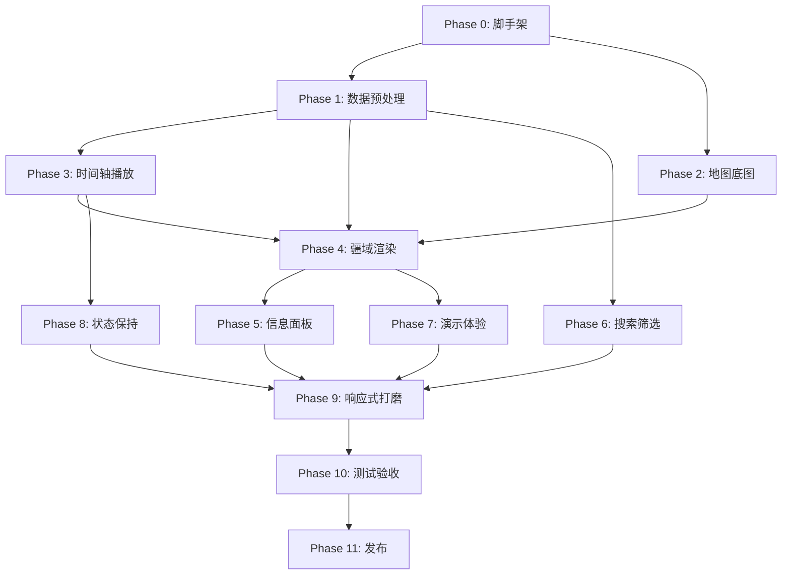

# 中国朝代更迭地图演示系统 — 全量任务列表

基于 MRD v0.1.2 | 创建日期：2026-05-15 | 数据基线：`input/v03`

---

## Phase 0：项目脚手架与架构设计

### 0.1 技术选型与项目初始化
- [ ] **T-0.1.1** 确定前端框架（推荐 Vite + React/Vue）并用 `npx` 初始化项目
- [ ] **T-0.1.2** 安装核心依赖：MapLibre GL JS、deck.gl、Turf.js
- [ ] **T-0.1.3** 配置 ESLint / Prettier / TypeScript
- [ ] **T-0.1.4** 建立目录结构规范（`src/components`、`src/stores`、`src/data`、`src/utils`、`scripts/`、`public/data/v03/`）
- [ ] **T-0.1.5** 配置 Git 忽略规则（大体积 CSV、node_modules、dist 等）

### 0.2 系统架构设计文档
- [ ] **T-0.2.1** 编写前端架构设计文档：组件树、数据流、状态管理方案
- [ ] **T-0.2.2** 设计预处理脚本架构：输入 CSV → 输出 JSON/GeoJSON 的完整 pipeline
- [ ] **T-0.2.3** 定义前后端数据接口契约（`years/{year}.json` schema、`polities.json` schema 等）
- [ ] **T-0.2.4** 设计颜色系统方案：`macro_period` → 色系映射、游牧/定居差异化渲染规则
- [ ] **T-0.2.5** 设计别名/同义词映射库 schema（简繁同体、异名同国）

---

## Phase 1：数据预处理 Pipeline（对应 MRD §7）

### 1.1 CSV 解析与索引生成
- [ ] **T-1.1.1** 编写脚本读取 `chinese_history_polities_master_v03.csv` → 输出 `public/data/v03/polities.json`
- [ ] **T-1.1.2** 编写脚本读取 `chinese_history_rulers_master_v03.csv` → 输出 `public/data/v03/rulers.json`
- [ ] **T-1.1.3** 编写脚本读取 `chinese_history_unresolved_or_disputed_v03.csv` → 输出 `public/data/v03/issues.json`
- [ ] **T-1.1.4** 编写脚本读取 `chinese_history_validation_report_v03.csv` → 输出 `public/data/v03/validation.json`
- [ ] **T-1.1.5** 生成 `public/data/v03/metadata.json`（data_version、生成时间、行数统计、年份范围）

### 1.2 年度切片 JSON 生成
- [ ] **T-1.2.1** 编写脚本按 `year` 分组 `chinese_history_polities_yearly_v03.csv`，生成 `public/data/v03/years/{year}.json`（约 2,955 个文件）
- [ ] **T-1.2.2** 年度 JSON 结构须符合 MRD §7.2 schema：含 polity_id、rulers 数组、territory 占位、quality 块
- [ ] **T-1.2.3** 处理年份展示规则：负整数 → "前X年"，正整数 → "X年"，跳过公元 0 年
- [ ] **T-1.2.4** 支持一个政权在同年匹配多位君主（统治交接）

### 1.3 别名映射库生成
- [ ] **T-1.3.1** 从 `polity_name` 和 `polity_aliases` 构建别名索引（如 刘宋↔宋、後唐↔后唐）
- [ ] **T-1.3.2** 输出 `public/data/v03/alias_index.json`
- [ ] **T-1.3.3** 从 `ruler_name`、`ruler_temple_name`、`ruler_posthumous_name`、`ruler_personal_name` 构建君主别名索引

### 1.4 关键历史事件数据
- [ ] **T-1.4.1** 编制关键历史事件种子数据（约 30-50 条：秦灭六国、淝水之战、靖康之变等）
- [ ] **T-1.4.2** 输出 `public/data/v03/events.json`（year、event_label、event_description、related_polity_ids）

### 1.5 预处理验证
- [ ] **T-1.5.1** 验证生成的年度 JSON 总数 = 2,955
- [ ] **T-1.5.2** 验证政权数 = 167、君主数 = 934、年度行数 = 36,359
- [ ] **T-1.5.3** 验证无公元 0 年文件
- [ ] **T-1.5.4** 验证所有 `polity_id` / `ruler_id` 跨文件关联一致性

---

## Phase 2：地图底图（对应 MRD §6.1 MAP-001/002）

### 2.1 MapLibre 基础集成
- [ ] **T-2.1.1** 初始化 MapLibre GL JS 实例，设置默认中心 [105, 35]、zoom 3.8
- [ ] **T-2.1.2** 加载海岸线与陆地底图（Natural Earth 或开源瓦片服务）
- [ ] **T-2.1.3** 实现缩放、平移、重置视角（一键回到默认欧亚视角）

### 2.2 物理地理图层
- [ ] **T-2.2.1** 集成海拔阴影层（ETOPO 或 Terrain RGB DEM tiles）
- [ ] **T-2.2.2** 加载主要河流矢量层（Natural Earth rivers 或 HydroRIVERS 简化版）
- [ ] **T-2.2.3** 加载湖泊矢量层
- [ ] **T-2.2.4** 加载山脉/物理地理标签层
- [ ] **T-2.2.5** 实现图层开关 UI（海拔、山脉标签、河流、湖泊各自可切换）
- [ ] **T-2.2.6** 确保图层渲染顺序：底图 → 海拔 → 河流/湖泊 → 政权疆域 → 标签

---

## Phase 3：时间轴与播放控制（对应 MRD §6.2 TIME-001/002）

### 3.1 时间轴 UI 组件
- [ ] **T-3.1.1** 实现时间控制条组件（底部固定）：播放/暂停按钮、上一年/下一年按钮
- [ ] **T-3.1.2** 实现年份滑条（range slider），范围 -1046 ~ 1912，跳过 0
- [ ] **T-3.1.3** 实现年份直接输入框（支持负整数，回车跳转）
- [ ] **T-3.1.4** 实现速度选择器（0.5x / 1x / 2x / 5x / 10x）
- [ ] **T-3.1.5** 年份显示转换：`-221` → "前221年"，`1368` → "1368年"

### 3.2 播放引擎
- [ ] **T-3.2.1** 实现播放循环：按设定速度逐年推进，加载对应 `years/{year}.json`
- [ ] **T-3.2.2** 实现暂停/恢复逻辑
- [ ] **T-3.2.3** 实现年度 JSON 按需加载 + 相邻年份预缓存策略
- [ ] **T-3.2.4** 跨 BCE/CE 边界时正确跳过公元 0 年（从 -1 跳到 1）
- [ ] **T-3.2.5** 时间线重要节点标记（秦统一、三国并立、隋唐交替等，可复用 events.json）

---

## Phase 4：政权疆域渲染（对应 MRD §6.3/6.4）

### 4.1 近似疆域匹配
- [ ] **T-4.1.1** 获取现代中国省级行政边界 GeoJSON（Natural Earth admin-1 或 GeoJSON.cn）
- [ ] **T-4.1.2** 编写匹配脚本：解析 `modern_admin_units_raw` 文本 → 匹配省/市级行政区 → 合并为 polygon
- [ ] **T-4.1.3** 输出 `public/data/v03/territories/approx_polities.geojson`
- [ ] **T-4.1.4** 输出 `public/data/v03/territories/territory_match_report.csv`（含 match_confidence）
- [ ] **T-4.1.5** 使用 Turf.js `area` 计算每个 polygon 的 `approx_area_km2`
- [ ] **T-4.1.6** 匹配失败的政权标记为 "待补充/无法估算"
- [ ] **T-4.1.7** 支持加载 `territory_override.csv` 人工维护表，优先使用人工修正的疆域匹配结果

### 4.2 疆域渲染
- [ ] **T-4.2.1** 在 MapLibre 中加载 GeoJSON 疆域层，按 `polity_id` 着色
- [ ] **T-4.2.2** 实现颜色系统：同 `macro_period` 近似色系，同 `polity_id` 跨年不变
- [ ] **T-4.2.3** 实现政权标签层（polity_name 文字标注）
- [ ] **T-4.2.4** 实现 LOD 标签防碰撞：低 zoom 仅显示大国标签，高 zoom 逐步展示小国
- [ ] **T-4.2.5** 实现游牧政权差异化渲染：虚线边界 + 羽化渐变/斑马纹理
- [ ] **T-4.2.6** 实现选中高亮效果（边框加粗/发光）
- [ ] **T-4.2.7** 年度切换时疆域淡入淡出过渡动画
- [ ] **T-4.2.8** 在图例中标注 "现代行政区近似，非历史精确边界"

### 4.3 都城标记
- [ ] **T-4.3.1** 为每个政权的 `capital_modern` 查找经纬度坐标
- [ ] **T-4.3.2** 在地图上渲染都城 Marker（星形/菱形图标）
- [ ] **T-4.3.3** 实现多都城动态化：播放到迁都年份时 Marker 位置平滑移动

---

## Phase 5：信息面板（对应 MRD §6.5 INFO-001）

### 5.1 右侧信息面板框架
- [ ] **T-5.1.1** 实现可折叠的右侧面板组件
- [ ] **T-5.1.2** 实现 "年度概况" 标签页：当前年份、政权总数、政权列表
- [ ] **T-5.1.3** 实现 "政权详情" 标签页（点击政权后展示）

### 5.2 政权详情字段展示
- [ ] **T-5.2.1** 展示基础信息：政权名称、别名、宏观时期、朝代分组、政权类型、起止年
- [ ] **T-5.2.2** 展示都城（含动态迁都标注）、族属/统治家族
- [ ] **T-5.2.3** 展示创建者、末代君主、灭亡或继承关系
- [ ] **T-5.2.4** 展示当前年份君主信息：称号、庙号、谥号、本名、统治起止年、年号
- [ ] **T-5.2.5** 展示近似面积与口径说明
- [ ] **T-5.2.6** **数据溯源板块（P0）**：醒目展示 `polity_source_titles`、`polity_source_raw`
- [ ] **T-5.2.7** 展示置信度评分（可视化进度条 + 数值）
- [ ] **T-5.2.8** 展示来源 URL（可点击跳转）
- [ ] **T-5.2.9** 展示争议/未定说明（从 issues.json 关联）
- [ ] **T-5.2.10** 君主缺失时显示 "该年度暂未匹配到可解析君主年表"

### 5.3 政权列表
- [ ] **T-5.3.1** 当年所有政权的可滚动列表，点击可选中并在地图高亮
- [ ] **T-5.3.2** 列表项包含政权名、类型标签、置信度色标

---

## Phase 6：搜索与筛选（对应 MRD §6.6 SEARCH-001/FILTER-001）

### 6.1 搜索功能
- [ ] **T-6.1.1** 实现全局搜索框（左侧浮层或顶部）
- [ ] **T-6.1.2** 搜索逻辑：输入年份 → 直接跳转；输入政权名/别名 → 定位政权；输入君主名 → 定位君主
- [ ] **T-6.1.3** 接入别名映射库，支持简繁同体和异名同国搜索
- [ ] **T-6.1.4** 搜索结果下拉列表，含类型标签（政权/君主/年份）

### 6.2 筛选功能
- [ ] **T-6.2.1** 实现政权类型筛选（诸侯国/古国、王朝/政权、割据政权等）
- [ ] **T-6.2.2** 实现置信度阈值筛选
- [ ] **T-6.2.3** 实现争议项筛选开关
- [ ] **T-6.2.4** 实现疆域状态筛选（已生成疆域 / 无法估算）

---

## Phase 7：演示体验与事件层（对应 MRD §6.7 DEMO-001）

### 7.1 演示效果
- [ ] **T-7.1.1** 疆域变化淡入淡出/平滑过渡动画
- [ ] **T-7.1.2** 自动镜头跟随：播放时地图视角自动聚焦到当年主要政权范围
- [ ] **T-7.1.3** 并存政权数量多时保持稳定视角（不频繁跳动）
- [ ] **T-7.1.4** 一键重置到默认欧亚视角

### 7.2 关键历史事件节点层
- [ ] **T-7.2.1** 加载 `events.json`，在时间线上标记关键事件年份（小圆点/旗帜图标）
- [ ] **T-7.2.2** 播放到事件年份时，在地图上浮现事件气泡（如 "前221年 秦灭齐，统一六国"）
- [ ] **T-7.2.3** 事件气泡 3-5 秒后自动淡出，或用户点击关闭

### 7.3 图例
- [ ] **T-7.3.1** 实现动态图例：按当年存在政权的 `macro_period` 分组展示颜色
- [ ] **T-7.3.2** 图例中区分实线（定居）与虚线（游牧）图案

---

## Phase 8：本地状态保持（对应 MRD §6.8 STATE-001/002/003）

### 8.1 StateStore 抽象层
- [ ] **T-8.1.1** 实现 `StateStore` 接口：`load()` / `save()` / `patch()` / `subscribe()` / `export()` / `import()` / `reset()`
- [ ] **T-8.1.2** 实现 IndexedDB 适配器（主存储，object store `app_state`）
- [ ] **T-8.1.3** 实现 localStorage 启动标记（`last_state_updated_at`、`last_state_schema_version`）
- [ ] **T-8.1.4** 编写 StateStore 单元测试（覆盖默认状态、保存、恢复、导入、导出、迁移、损坏回退）

### 8.2 状态数据模型
- [ ] **T-8.2.1** 实现状态 JSON schema（含 `schema_version`、`app_version`、`data_version`、`updated_at`）
- [ ] **T-8.2.2** 实现各状态分块：timeline、map_view、selection、layers、filters、ui
- [ ] **T-8.2.3** 写入策略：debounce 300-1000ms，播放时只在年度切换完成后保存
- [ ] **T-8.2.4** `beforeunload` / 页面隐藏时 flush 最新状态

### 8.3 状态恢复与异常处理
- [ ] **T-8.3.1** 应用启动时：加载 metadata → 加载本地状态 → schema 迁移 → 数据版本校验 → 恢复 UI
- [ ] **T-8.3.2** 状态损坏/不可解析时回退默认状态并提示 "已重置损坏状态"
- [ ] **T-8.3.3** 年份超出当前数据范围时跳转到最近可用年份
- [ ] **T-8.3.4** `polity_id` / `ruler_id` 不存在时清除选中项但保留其他状态

### 8.4 导入导出与多标签页
- [ ] **T-8.4.1** 实现导出状态为 JSON 文件（命名 `history-map-state-v03-{timestamp}.json`）
- [ ] **T-8.4.2** 实现导入状态：校验 schema + 数据版本 + 年份范围
- [ ] **T-8.4.3** 实现 BroadcastChannel 多标签页同步（last-write-wins by `updated_at`）
- [ ] **T-8.4.4** 实现一键重置到默认状态

---

## Phase 9：响应式设计与视觉打磨（对应 MRD §9.3）

### 9.1 响应式布局
- [ ] **T-9.1.1** 屏幕宽度 < 768px 时：右侧面板转为底部抽屉式弹窗（Bottom Sheet Drawer）
- [ ] **T-9.1.2** 时间轴控制条在窄屏下自动精简为紧凑模式
- [ ] **T-9.1.3** 地图 Hover 交互在触屏降级为 Click 触发

### 9.2 视觉打磨
- [ ] **T-9.2.1** 整体 UI 主题设计（暗色/亮色/跟随系统）
- [ ] **T-9.2.2** 字体选择（中文正文 + 地图标签）
- [ ] **T-9.2.3** 加载状态 Loading 骨架屏
- [ ] **T-9.2.4** 错误状态 UI（数据文件缺失、年度 JSON 加载失败）
- [ ] **T-9.2.5** 来源与质量浮层（数据版本、校验状态、争议说明、底图来源）

---

## Phase 10：测试与验收（对应 MRD §11）

### 10.1 数据验收 (MRD §11.1)
- [ ] **T-10.1.1** 验证 5 个 v03 CSV 均被正确读取
- [ ] **T-10.1.2** 验证政权数 167、君主数 934、年度行数 36,359
- [ ] **T-10.1.3** 验证年份范围 前1046年 ~ 1912年，无公元 0 年
- [ ] **T-10.1.4** 验证 `validation_report` 中 PASS/WARN 状态正确展示
- [ ] **T-10.1.5** 验证中山国、薛国部分边界 WARN 可在 UI 追溯

### 10.2 播放验收 (MRD §11.2)
- [ ] **T-10.2.1** 播放、暂停、调速、上一年、下一年、滑条、年份输入均可用
- [ ] **T-10.2.2** 关键年份跳转测试：前1046、前688、前221、220、907、960、1271、1368、1644、1912
- [ ] **T-10.2.3** 并存政权年份全部显示
- [ ] **T-10.2.4** BCE/CE 跨越跳过公元 0 年

### 10.3 地图验收 (MRD §11.3)
- [ ] **T-10.3.1** 欧亚大陆物理地图可见
- [ ] **T-10.3.2** 海拔、山脉、河流、湖泊层可开关
- [ ] **T-10.3.3** 政权疆域 polygon 可点击
- [ ] **T-10.3.4** 标签与颜色不严重遮挡
- [ ] **T-10.3.5** 最大并存年份（54 政权）下地图仍可交互

### 10.4 疆域与面积验收 (MRD §11.4)
- [ ] **T-10.4.1** 有匹配的政权显示近似 polygon
- [ ] **T-10.4.2** 无匹配项显示 "待补充/无法估算"
- [ ] **T-10.4.3** 面积字段展示为 `approx_area_km2`
- [ ] **T-10.4.4** UI 不将近似面积表述为历史精确面积
- [ ] **T-10.4.5** territory_match_report 可追溯

### 10.5 来源验收 (MRD §11.5)
- [ ] **T-10.5.1** 政权来源标题与 URL 可查看
- [ ] **T-10.5.2** 君主来源标题与 URL 可查看
- [ ] **T-10.5.3** 所有外部参考在 "来源与参考" 中列出
- [ ] **T-10.5.4** 争议说明可从 issues.json 追溯

### 10.6 本地状态验收 (MRD §11.6)
- [ ] **T-10.6.1** 关闭后再次打开完整恢复年份/视角/图层/筛选/选中项
- [ ] **T-10.6.2** 播放状态跨会话恢复
- [ ] **T-10.6.3** 暂停状态跨会话恢复
- [ ] **T-10.6.4** 导出/导入状态跨设备可用
- [ ] **T-10.6.5** 数据版本变化后迁移正常
- [ ] **T-10.6.6** 本地状态损坏时自动回退
- [ ] **T-10.6.7** 多标签页不互相覆盖

### 10.7 性能验收 (MRD §10.1)
- [ ] **T-10.7.1** 首屏底图加载不等待全部年度 JSON
- [ ] **T-10.7.2** 播放时年度切换响应 < 200ms
- [ ] **T-10.7.3** 54 政权并存年份无明显卡顿

---

## Phase 11：发布准备

### 11.1 文档与说明
- [ ] **T-11.1.1** 编写 README.md（项目概述、技术栈、本地运行步骤）
- [ ] **T-11.1.2** 编写数据口径说明文档（数据来源、近似疆域口径、置信度含义）
- [ ] **T-11.1.3** 编写使用说明（演示操作指南、快捷键）

### 11.2 构建与部署
- [ ] **T-11.2.1** 生产构建优化（代码分割、资源压缩）
- [ ] **T-11.2.2** 配置静态站点部署方案（GitHub Pages / Vercel / Netlify）
- [ ] **T-11.2.3** 确保预处理输出文件随代码一起部署

### 11.3 最终验收
- [ ] **T-11.3.1** 完成完整数据验收清单
- [ ] **T-11.3.2** 完成关键年份端到端测试
- [ ] **T-11.3.3** 准备演示脚本（推荐播放路线与镜头策略）
- [ ] **T-11.3.4** 标记 v1.0.0 版本 tag 并发布

---

## 任务统计

| Phase | 描述 | 任务数 |
|-------|------|-----:|
| Phase 0 | 脚手架与架构设计 | 10 |
| Phase 1 | 数据预处理 Pipeline | 17 |
| Phase 2 | 地图底图 | 9 |
| Phase 3 | 时间轴与播放控制 | 10 |
| Phase 4 | 政权疆域渲染 | 18 |
| Phase 5 | 信息面板 | 15 |
| Phase 6 | 搜索与筛选 | 8 |
| Phase 7 | 演示体验与事件层 | 8 |
| Phase 8 | 本地状态保持 | 16 |
| Phase 9 | 响应式设计与视觉打磨 | 8 |
| Phase 10 | 测试与验收 | 27 |
| Phase 11 | 发布准备 | 7 |
| **合计** | | **153** |

---

## 依赖关系与建议执行顺序

> **关键路径**：Phase 0 → Phase 1 → Phase 3/4 → Phase 5 → Phase 10 → Phase 11
> 
> **可并行**：Phase 2 与 Phase 1 可并行；Phase 6/7/8 可在 Phase 4 完成后并行推进。
